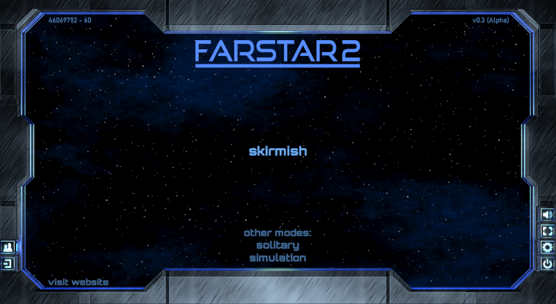
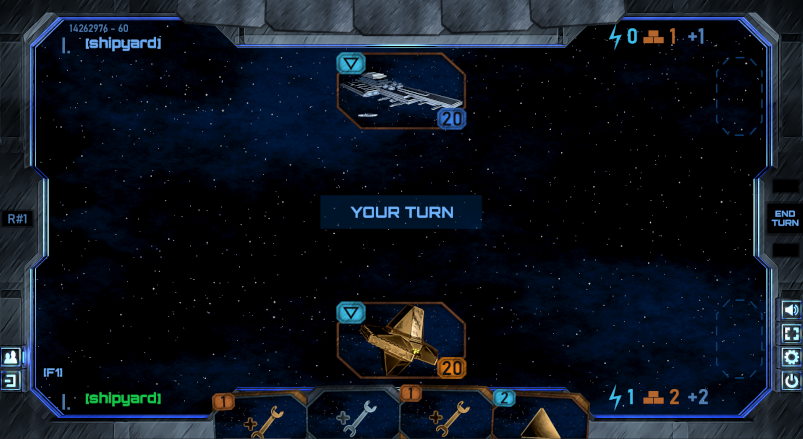
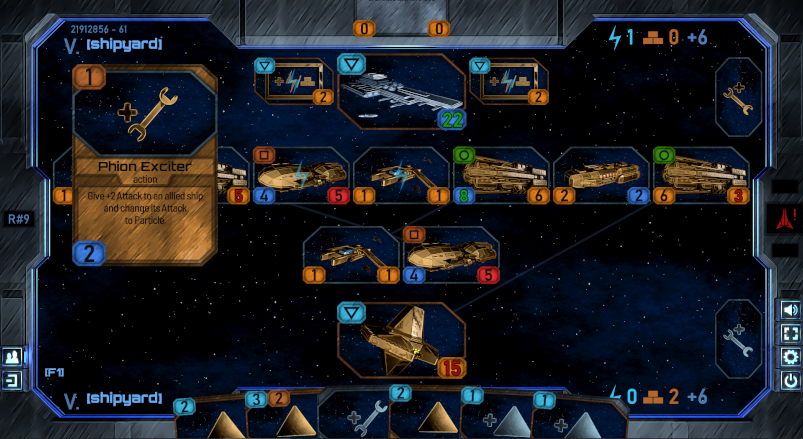
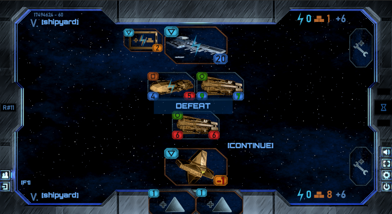

# Farstar 2  
  
  
  
This is a FREE game demo.  
  
[WINDOWS RELEASE DOWNLOAD](https://github.com/Dark-Gran/Farstar-2/releases/download/v0.3-alpha/FARSTAR2_DOWNLOAD_WIN.rar)  
  
Use [WinRAR](https://www.google.com/search?q=winrar) or similar to extract game files.  
Launch with exe (no installation required).  
*Use F1 in game to show Help/Instructions.*  
If you'd like to give me feedback or see my other projects, [join us on Discord!](https://discord.com/invite/N4JxKsX3Q5)

If you like the game so much you want to see it grow, [I've already made a Patreon page](https://www.patreon.com/darkgran), _just in case_.  
  
## About Project  

_(to be updated)_  
I've always enjoyed card games (both collectible and 'classic'), so after an attempt to merge them with a strategy genre, I've decided to make a game that actually fits the 'card game' description.  
  
With that in mind (and with feedback in hands), game's rules have been _drastically_ changed, therefore the entire application is being 'rewritten' from the scratch.  
  
This time in Java (with LibGDX for OpenGL). One of the main reasons behind the original choice of Adobe Air (in which the original game has been written) was the fact that it is cross-platform, however such is the case with Java as well. For applications of this size, Java is also a more lightweight (performance-wise) solution.  

(For the previous version of the game, see [Farstar: Exodus](https://github.com/Dark-Gran/Farstar-Exodus).)   

  
## Progress  

_(to be updated)_  
**_Current goal is to create an 'offline demo' of the reworked gameplay (incl. artwork and basic effects)._**  
LAN support will be added after the first release.  

Customizable Decks, additional Cards, Tutorial, sound and music, proper support of different resolutions, and Server Application with user registrations, matchmaking, a shop for card packs, and direct card-trading between players (all are features of the original game) will be added depending on reception.  
Same goes for story-driven Campaigns, unique portraits for non-ship cards, better and/or more visual effects, better/harder AI, general optimization, mobile support, and other game-modes besides 1v1.
  
~~Paper-Prototype~~  
~~Prototype (Java + LibGDX)~~  
~~On-screen gameplay tests and Basic AI for more tests~~  
~~General (Table) and MainScreen GUI+GFX 'import'~~  
~~Battle GUI+GFX 'import'~~  
~~Card Portraits 'import'~~  
~~Game-Rules Summary (F1)~~  
~~Finishing touches (eg. card and AI revision)~~  
~~Alpha Release~~  
  
  
### Font Credits

**ALL FONTS** used in the game belong to their respective authors, and so do my thanks for publishing these fonts under Open Font License or similar:  
Bahnschrift - Aaron Bell  
Barlow - Jeremy Tribby  
Good Times (edited; non-embed) - Ray Larabie  
Orbitron - Matt McInerney  
  
  
## Screenshots  
  
  

  

  

  
