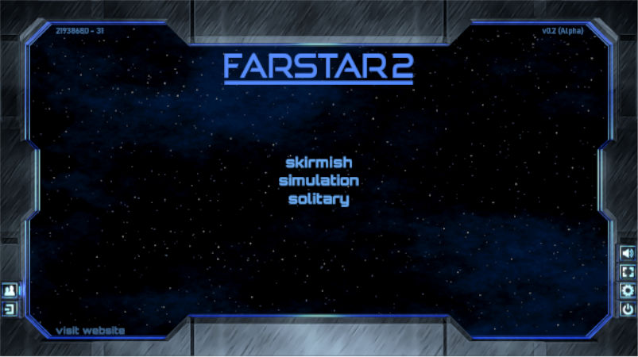

# Farstar 2  
  
  
  
For the original game, see [Farstar: Exodus](https://github.com/Dark-Gran/Farstar-Exodus).  
  
## About Project  
  
I've always enjoyed card games (both collectible and 'classic'), so after an attempt to merge them with a strategy genre, I've decided to make a game that actually fits the 'card game' description.  
  
With that in mind (and with feedback in hands), game's rules have been _drastically_ changed, therefore the entire application is being 'rewritten' from the scratch.  
  
This time in Java (with LibGDX for OpenGL). One of the main reasons behind the original choice of Adobe Air (in which the original game has been written) was the fact that it is cross-platform, however such is the case with Java as well. For applications of this size, Java is also a more lightweight (performance-wise) solution.

  
## Progress  
  
**_Current goal is to create an 'offline demo' of the reworked gameplay (incl. artwork and basic effects)._**  
LAN support will be added after the first release.  

Customizable Decks, proper Tutorials and Campaigns, proper support of different resolutions, better and/or more visual effects, mobile support, and Server Application with user registrations, matchmaking, a shop for card packs, and direct card-trading between players (all are features of the original game) will be added depending on reception.
  
~~Paper-Prototype~~  
~~Prototype (Java + LibGDX)~~  
~~On-screen gameplay tests and Basic AI for more tests~~  
~~General (Table) and MainScreen GUI+GFX 'import'~~  
~~Battle GUI+GFX 'import'~~  
Card Portraits 'import'  
Game-Rules Summary (F1)  
Finishing touches (eg. card and AI revision)  
Alpha Release  

### Font Credits

**ALL FONTS** used in the game belong to their respective authors, and so do my thanks for publishing these fonts under Open Font License or similar:  
Bahnschrift - Aaron Bell  
Barlow - Jeremy Tribby  
Good Times (edited; non-embed) - Ray Larabie  
Orbitron - Matt McInerney  
