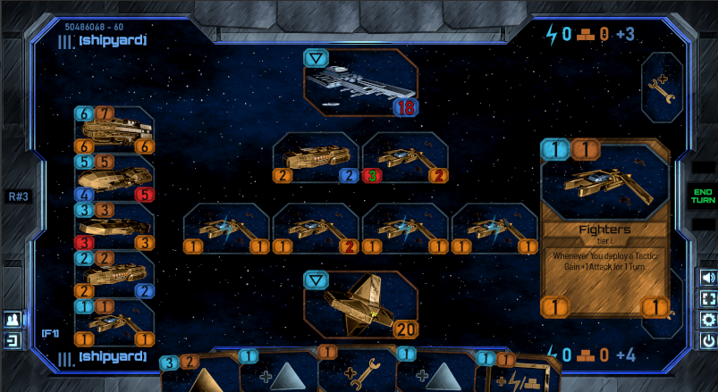

# Farstar 2  
  
  
  
This is a FREE game demo.  
  
[**WINDOWS RELEASE DOWNLOAD**](https://github.com/Dark-Gran/Farstar-2/releases/download/v0.3-alpha/FARSTAR2_DOWNLOAD_WIN.rar)  
  
Use [WinRAR](https://www.google.com/search?q=winrar) or similar to extract game files.  
Launch with exe (no installation required).  
*Use F1 in game to show Help/Instructions.*  
If you'd like to give me feedback or see my other projects, [talk to us on Discord!](https://discord.com/invite/N4JxKsX3Q5)  
  
If you want to know about _everything_ we do, I'll be happy if you [follow me on my humble Twitter](https://twitter.com/DarkGran_CZ).
  
[_(jump to spoilers)_](#screenshots)
  
  
## Future Features

### Things to add that actually were in the original game
  
- **Customizable Decks**  
- **Way more cards** 
  - Over 60 ship portraits are waiting to be updated and added, which includes both shipyard and rare ships that you draw like Actions or Tactics. The original game also contained over 200 "actions", bringing the total with ships close to 300 cards - and that was meant only as a start of something much greater! This of course includes adding many new abilities to go with these cards.  
- **Multiplayer**  
- **Server for matchmaking and user-stats**
- **In-game reward system for unlocking/crafting cards**   
  - It's not meant to be a grind, but it is a _collectible_ card game. Giving the entire collection to new players right away ruins part of the fun.
- **Real-time card-trading between players** 
  - Check out each others "cards for trade" and make a deal, like in a real world game room. Something that no other online card game has (auctions, at best :p).
- **Complete support of different resolutions**
- **Tutorial**

### More things we want to add

- **2v2 Mode** 
  - Yes: the paper version is already playable as 2v2, and if you check out the code, you may notice that it's actually prepared for more than just 1v1 matches as well (which does not only mean the possibility of 2v2, but for example a free-for-all as well). Let's fight friends with friends! ;)
- **Story-driven Campaigns** 
  - The original Tutorial was not only hand-holdy, but also filled with way too much story, keeping away the player from focusing on the mechanics. But I clearly love to tell stories! So we would like to continue with those, this time in a proper campaign mode.
- **Even more cards**
  - We talked about the almost 300 cards in the original game, but we actually have around _700 card drafts_ lying around from 5 Species containing 11 Factions. This includes different game mechanics for each Species, whether it's a twist on resources or a way they treat their Shipyard (or ships in general).  
- **Sound and Music** 
  - Well, the original game actually had both, but the music track is just a quick placeholder, and the quality of equipment (and, again, time) that we had to make the sounds was just to low to achieve anything decent.  
- **Better visual effects** 
  - There is only a "necessary handful" of effects in game: most cards actually deserve their own, and there should be effects at certain points of plays that are just missing at this moment. And the effects that _are_ there were made with limited time too - especially the ship-explosion is just a placeholder.  
- **Unique portraits for all non-ships too** _(may change)_  
- **Better AI**  
- **Release for mobiles and other platforms**

Visuals to make and lines of code to write are many.  
**If you made it this far, and you would love to see it all happen, please consider [becoming our Patron](https://www.patreon.com/bePatron?u=60109614) to support us, we would greatly appreciate it!**  

  
  
## About Project  
 
I've always enjoyed card games (both collectible and 'classic'), so after a rather experimental attempt to merge them with a strategy genre, which lead to a gameplay that I was not satisfied with, I've decided to make a game that actually fits the 'card game' description while using only a few of the original ideas.  
  
With that in mind (and with some feedback in hands), game's rules have been _drastically_ changed, therefore the entire application has been 'rewritten' from the scratch.  
  
This time in Java (with LibGDX for OpenGL). One of the main reasons behind the original choice of Adobe Air (in which the original game has been written) was the fact that it is cross-platform, however such is the case with Java as well. For applications of this size, Java is also a more lightweight (performance-wise) solution.  

(For the previous version of the game, see [Farstar: Exodus](https://github.com/Dark-Gran/Farstar-Exodus) - but be warned, it's so dark it's barely visible.)   

## Credits

Thanks to all my bros for helping me with the gameplay! Especially Mr. Anderson who is responsible for some of the key mechanics.
  
### Font Credits

**ALL FONTS** used in the game belong to their respective authors, and so do my thanks for publishing these fonts under Open Font License or similar:  
Bahnschrift - Aaron Bell  
Barlow - Jeremy Tribby  
Good Times (edited; non-embed) - Ray Larabie  
Orbitron - Matt McInerney  
  
  
## Screenshots  
  
  

  

  

  

[_(jump back up)_](#farstar-2)  
